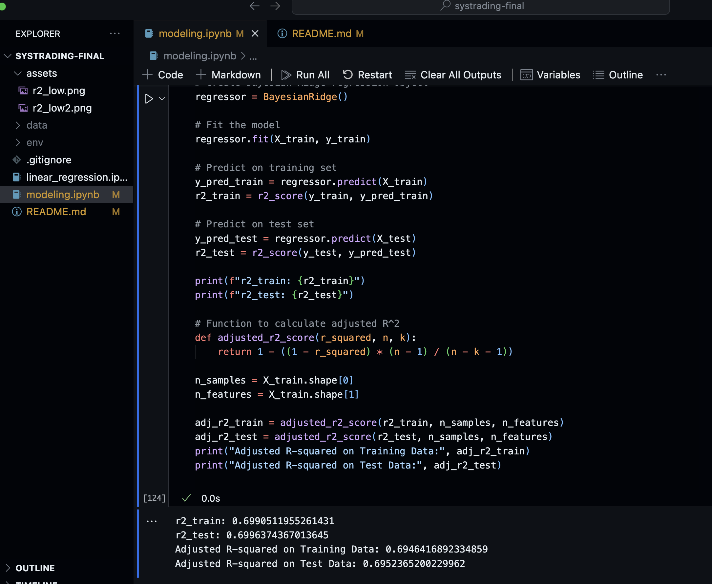
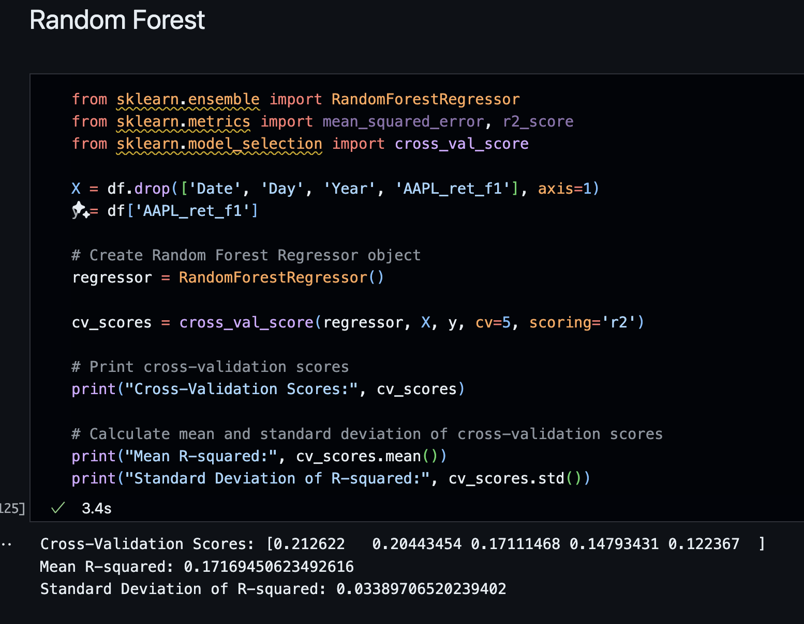

# ESG Company Trading Strategy
Table of contents:
- [ESG Company Trading Strategy](#esg-company-trading-strategy)
  - [Data Processing](#data-processing)
    - [Data Sampling](#data-sampling)
      - [Time-Seriss cross-validation](#time-seriss-cross-validation)
    - [Data Massaging](#data-massaging)
  - [Modeling](#modeling)
      - [Initial exploration](#initial-exploration)
      - [Differnt models](#differnt-models)
      - [Random Forest](#random-forest)
      - [Changing prediction target](#changing-prediction-target)
    - [Compare with baseline models](#compare-with-baseline-models)
    - [Evaluate the performance under different market conditions](#evaluate-the-performance-under-different-market-conditions)
  - [Metrics](#metrics)
  - [Findings](#findings)
  - [Terms](#terms)
  - [Dicussion](#dicussion)

**Training Input:** 3 year of S&P 500 ESG Index, AAPL'S equity Stock Prices 
**Output:** A model that can predict future prices

**Model input:** S&P 500 ESG Index of past {variable} period of time, AAPL'S equity Stock Prices for the past {var2} period of time
**Model Output:** Predicted AAPL'S equity Stock Prices for the next {var3} period of time

**Questions**
- How to predict the next day's price base on SPESG and return of past? 
- And that how big should the window be?
- How to test the result in a systematic way?
  - Draw the Equity Graph, and compore with test set. Calculate accuracy, precision, auc, etc.
  - Calcute the financial to indicators, sharpe ratio, max drawdown, alpha, etc

## Data Processing
### Data Sampling
so i have  5 year of data, I plan to split the data into 80% of training set, 20% of holdout set;
for 80% of training set, I will use cross-validation to evaluate the performance and save the 20% of holdout set in the last testing phase to evaluate the robustness of the model. 
I have 5 years of Apple's prices, Microsoft's prices, and Tesla's prices, I will use Apple's 3 year data for training, doing cross-val, and use left 2 years' data for testing. After done with modeling and evaluation, I will try the same thing thing with Microsoft and Tesla.

#### Time-Seriss cross-validation 
"Time-Series Cross-Validation: Given the sequential nature of stock data, traditional random cross-validation might not be appropriate. Instead, use techniques like rolling or expanding window cross-validation, which respect the time series structure and are better at mimicking the real-world scenario where only past data is used to predict future outcomes."

### Data Massaging
After calculating return 250, the first 249 days of cells under `ret250` will be empty, thus has NaN values. Here for the sake of keeping the data intact, I will fill the mean values instead of droping the rows containing NaN values.

## Modeling
#### Initial exploration
First, I used the simplest model `linear regression`  to predict the next day's price. The features used to train are 'AAPL_Volume(M)', 'AAPL_SMAVG15(M)', 'SPESG', the result are: 
- Coefficients:  [[0.01268778 0.00806344 0.68694972]]
- Variance score: 0.8772854909543317

And I added the last day's price 'AAPL_Px_Shift1' as a feature, the result are:
- Coefficients:  [[-0.00211847  0.00110984  0.01333341  0.98013466]]
- Variance score: 0.9970315820445652

We can see a significant improvement in the variance score, which means the model is more accurate, and the coefficient of 'AAPL_Px_Shift1' is 0.98, which means the last day's price is the most important feature to predict the next day's price. Now it seems that the model is overfitting, so I will try to use a more complex model to predict the next day's price.

After getting such a high score on R squared, I realized somthing is really off, I dug back and found out that I shouldn't predict close price, but instead, I should predict returns. So I change the prediction target to daily returns and retrained the model, then I got a R squred close to 0 on the training set, and negative on a test set. Now I know I'm slightly on the track, but obviously, the model is too simple to predict anything, and my features are not strong enough to predict the one day forward return. 

So I created ret5, ret10, ret30, ret60, ret120, and ret250 as features as well, trying to add more complexity to the model. This time after retrain the linear regression using these features, the R squred value on the training set increased very slightly, but R squred value on the test set become more negative.

Right now, I know I should increase model complexity, experimenting with different models, dealing with outliers, doing cross-validation, using regularization to avoid over-fitting, etc., to both increase the model complexity and have a more accurate prediction.

#### Differnt models
|    | R^2 Training set | R^2 Test set | 
|----| -----------------| -------------|
|Logistic regression | 0.06 | -0.09 | 
|Bayesian regression | 0.015 | 0.00 | 
|Decision Tree(depth20) | 0.973 | -1.116|

**We can conclude that the model overfits severly by the metrics given by decision tree, the model has learned noise and specific patterns in the training data that do not generalize to new data. So I will use ensemble models like random forest or XG Boost, etc to reduce the overfitting issue, and use cross-validation to replace train-test split.**

#### Random Forest
Cheerfully, after fitting with random forest, the r2 squared values become: r2_train: 0.846, r2_test: -0.118. Which means the model come predict on the training set pretty decently, but it is still over-fits. Even though the model is still very over-fitting, now at least I know the ensemble methods work much better than any other base models on the training sets.

**Now I will write a solver to find the best parameters for the random forest**
Random Forest models can overfit if they are too complex, I can try reducing the number of trees in the forest (`n_estimators`), limiting the maximum depth of the trees (`max_depth`), or increasing the minimum number of samples required to split a node (`min_samples_split`).

"When tuning these hyperparameters, it's essential to strike a balance between model complexity and performance on unseen data. This often involves experimentation and iterative refinement based on performance metrics obtained through cross-validation.

For example, you might start with a broad search over a range of hyperparameter values and then narrow down to a smaller range for finer tuning. Additionally, techniques like grid search or random search can help automate the 
hyperparameter tuning process by systematically exploring different combinations of hyperparameters."

**Cross validation**
After doing 5-folds cross-validation, we get the metrics on the model performance:
Cross-Validation Scores: [-0.0507099  -0.02806235 -0.30720464 -0.05822736 -0.14245818]
Mean R-squared: -0.11733248582526827
Standard Deviation of R-squared: 0.10255133019771644

Which means the ensemble model did pretty bad on the prediction.

After tweeking the parameters and models many times, I found out that the R squred value is constanly always negative, it got me thinking, is the prediction target too hard to predict? Is predicting the daily return too ambitious? Should I predict a range instead? Or should I only predict direction? etc. **I need to re-direct the steer.**

#### Changing prediction target
After changing the prediction target from one-day-forward retunr `AAPL_ret_f1` to moving averages `AAPL_Px_100MA`, the corelation between features and prediction target become much greater, and the R-squared value on both training test and test set are both positive now!

But when using cross-validation, the scores though are positive, are still very low.

**Now I'm thinking using moving averages and breakout system instead as the strategy!**

### Compare with baseline models
"It’s also useful to compare the R-squared of your model with that of a naive/baseline model, such as a model that predicts returns based on the average historical return. This can give you a better sense of how much additional explanatory power your model provides."

### Evaluate the performance under different market conditions

## Metrics
Sharpe Ratio, Maximum dropdown, Alpha and Beta, Residual Analysis

## Findings
- When tuning these hyperparameters, it's essential to strike a balance between model complexity and performance on unseen data, and it's very hard to do that.
- It is way more efficient if I build the measurement system first before tweeking with models.

## Terms
- What is R squred value? What does it indicate?
R-squared measures the proportion of the variance in the dependent variable that is predictable from the independent variables.
It's also crucial to supplement R-squared with other validation techniques, such as analyzing residuals and performing backtesting.
- Does alpha and equity graph apply here?

## Dicussion
- Do companies with high ESG scores are more likely to outperform the market in the long run?
